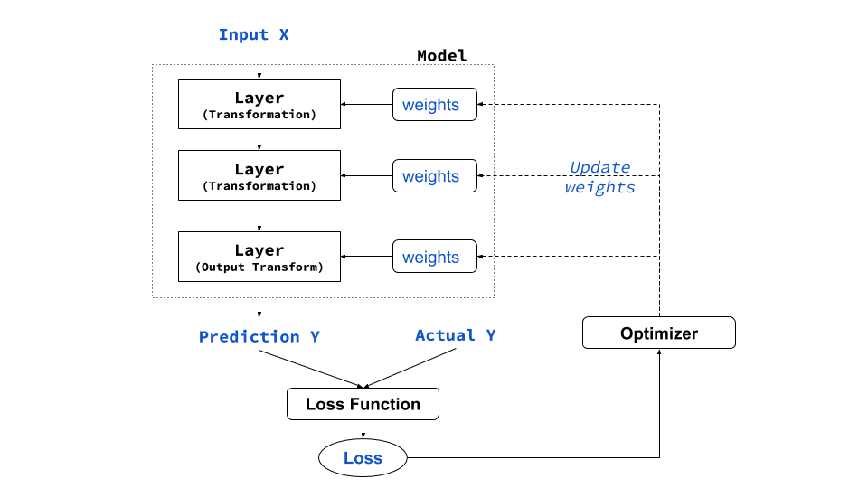

# [fit] Deep Learning Practical Guidance
_**Getting Started with Image & Text**_
 
 
 

**Amit Kapoor** [@amitkaps](http://amitkaps.com)
**Bargava Subramanian** [@bargava](http://bargava.com)
**Anand Chitipothu** [@anandology](http://anandology.com)

---

# Bootcamp Approach

- **Domain**: Image & Text
- **Applied**: Proven & Practical
- **Intuition**: Visualisation & Analogies 
- **Code**: Learning by Doing
- **Math**: Attend HackerMath!

---

# Learning Paradigm

---

# Learning Types & Applications

- **Supervised**: Regression, Classification, ...
- Unsupervised: Dimensionality Reduction, Clustering, ...
- Self (Semi)-supervised: Auto-encoders, Generative Adversarial Network, ...
- Reinforcement Learning: Games, Self-Driving Car, Robotics, ...

---

# Focus: Supervised Learning
- **Classification**: Image, Text, Speech, Translation
- Sequence generation: Given a picture, predict a caption describing it. 
- Syntax tree prediction: Given a sentence, predict its decomposition into a syntax tree.
- Object detection: Given a picture, draw a bounding box around certain objects inside the picture. 
- Image segmentation: Given a picture, draw a pixel-level mask on a specific object.

---

# Learning Approach

 

---

# Data Representation: Tensors

- Numpy arrays (aka Tensors)
- Generalised form of matrix (2D array)
- Attributes
    - Axes or Rank: `ndim` 
    - Dimensions: `shape` e.g. (5, 3) 
    - Data Type: `dtype` e.g. `float32`, `uint8`, `float64`

---

# Tensor Types

- **Scalar**: 0D Tensor
- **Vector**: 1D Tensor
- **Matrix**: 2D Tensor
- **Higher-order**: 3D, 4D or 5D Tensor

---

# Input $$X$$

| Tensor |  Example |  Shape                |
|:-------|:---------|:----------------------|
| 2D     | Tabular  | (samples, features)    |
| 3D     | Sequence | (samples, steps, features)    |
| 4D     | Images   | (samples, height, width, channels)    |
| 5D     | Videos   | (samples, frames, height, width, channels)    |

---

# Learning Unit

$$ y = RELU(dot(w,x) + bias) $$
**weights** are $$ w_1 ... w_n$$ & **activation** is RELU $$ f(z) = max(z,0) $$

---

# Model Architecture 

Basic Model: **Sequential** - A linear stack of layers.

Core Layers
- Dense Layers: Fully connected layer of learning units (Also called Multi-layer Perceptron)
- Flatten

---

# Output $$y$$ & Loss

| $$y$$ |  Last Layer Activation |  Loss Function      |
|:-------|:---------|:----------------------|
| Binary Class     | sigmoid  | Binary Crossentropy |
| Multi Class     | softmax | Categorical Crossentropy   |
| Multi Class Multi Label     | sigmoid   | Binary Crossentropy    |
| Regression     | None   | Mean Square Error   |
| Regression (0-1)    | sigmoid   | MSE or Binary Crossentropy   |

---

# Optimizers

- **SGD**: Excellent but requires tuning learning-rate decay, and momentum parameters 
- **RMSProp**: Good for RNNs
- **Adam**: Adaptive momentum optimiser, generally a good starting point.

---

# Guidance for DL 
> *General guidance on building and training neural networks. Treat them as heuristics (derived from experimentation) and as good starting points for your own explorations.*

---

# Pre-Processing
- **Normalize** / **Whiten** your data (Not for text!)
- **Scale** your data appropriately (for outlier)
- Handle **Missing Values** - Make them 0 (Ensure it exists in training)
- Create **Training & Validation Split**
- **Stratified** split for multi-class data
- **Shuffle** data for non-sequence data. Careful for sequence!!

---

# General Architecture
- Use **ADAM** Optimizer (to start with)
- Use **RELU** for non-linear activation (Faster  for learning than others)
- Add **Bias** to each layer
- Use **Xavier** or **Variance-Scaling** initialisation (Better than random initialisation)
- Refer to output layers activation & loss function guidance for tasks

---

# Dense / MLP Architecture
- No. of units reduce in deeper layer
- Units are typically $$2^n$$
- Don't use more than 4 - 5 layers in dense networks

---

# CNN Architecture (for Images)
- Increase **Convoluton filters** as you go deeper from 32 to 64 or 128 (Max)
- Use **Pooling** to subsample: Makes image robust from translation, scaling, rotation
- Use **pre-trained models** as *feature extractors* for similar tasks
- Progressively **train n-last layers** if the model is not learning
- **Image Augmentation** is key for small data and for faster learning

---

# RNN / CNN Architecture (for NLP)

- **Embedding** layer is critical. **Words** are better than **Characters**
- Learn the embedding with the task or use pre-trained embedding as starting point
- Use BiLSTM / LSTM vs Simple RNN. Remember, RNNs are really slow to train
- Experiment with 1D CNN with larger kernel size (7 or 9) than used for images.
- MLP can work with bi-grams for many simple tasks.

---

# Learning Process
- **Validation Process**
    - Large Data: Hold-Out Validation 
    - Smaller Data: K-Fold (Stratified) Validation
- **For Underfitting**
  - Add more layers: **go Deeper**
  - Make the layers bigger: **go wider**
  - Train for more epochs

---

# Learning Process
- **For Overfitting**
  - Get **more training data** (e.g. actual or image augmentation)
  - Reduce **Model Capacity**
  - Add **weight regularisation** (e.g. L1, L2)
  - Add **Dropouts** or use **Batch Normalization**

